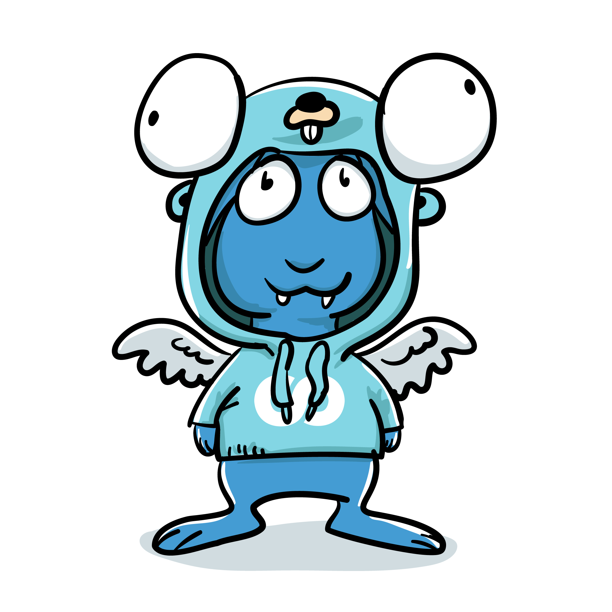

  

# go

Go standard library extension, adding the missing parts used in the foomo ecosystem to keep [DRY](https://en.wikipedia.org/wiki/Don%27t_repeat_yourself).

## How to Contribute

Contributions are welcome! Please read the [contributing guide](docs/CONTRIBUTING.md).

## License

Distributed under MIT License, please read the [license file](LICENSE) for more details.

_Made with ♥ [foomo](https://www.foomo.org) by [bestbytes](https://www.bestbytes.com)_
